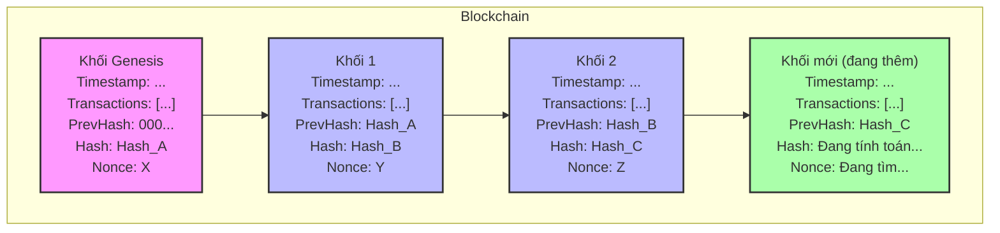

Đối với mình, blockchain là một lĩnh vực khá thú vị. Nó là một công nghệ khá mới, giải quyết nhiều vấn đề về niềm tin, chi phí,... 

---

## Định nghĩa

Nếu bạn search trên google thì sẽ có rất nhiều bài viết nói về định nghĩa của blockchain, nhưng để tóm gọn về định nghĩa blockchain thì nó là một loại cơ sở dữ liệu đặc biệt, phân tán, tất cả mọi người đều sở hữu nó nhưng gần như không thể thay đổi được nó. Về mặt lý thuyết thì bạn có thể thay đổi thông tin được lưu nhưng nó cực kì khó khăn và gần như là không thể.

## Ý tưởng



Bạn có thể thấy nó là một chuỗi các khối được liên kết với nhau, khối sau sẽ trỏ tới khối liền kề trước nó và cứ thế tiếp diễn. Nó tương tự như là một dây xích với các mắc xích liên kết với nhau vậy.

## Transaction

Đây là thông tin body của khổi, hay cũng thể nói là nội dung của cơ sở dữ liệu , nó có thể chứa bất cứ thứ gì, ở đây mình sẽ minh họa với transaction giao dịch chuyển tiền bao gồm thông tin người gửi, người nhận và số tiền.

```go
type Transaction struct {
	Sender    string
	Recipient string
	Amount    float64
}
```

## Block

Đây là phần quan trọng của blockchain, block thật tế sẽ chứa nhiều thông tin hơn, nhưng ở đây tôi sẽ cho một block chứa thông tin cơ bản.

```go
type Blockchain []*Block

type Block struct {
	Timestamp    int64
	Transactions []Transaction
	PrevHash     string
	Hash         string
	Nonce        int
}
```

- timestamp: là thời gian block được tạo ra.
- transactions: là danh sách transactions.
- prevhash: là chuỗi hash của block trước đó, trỏ về block trước đó.
- hash: là hash của block hiện tại.
- nonce: là số dùng cho PoW. Nó như là một chìa khóa để mở ổ khóa khi thực hiện quá trình tìm hash của block. Ở phần PoW tôi sẽ nói kỹ hơn.

## Tính toán hash

Chúng ta sẽ thực hiện hash toàn bộ thông tin của block kể cả timestamp, prevHash, Nonce. Ở đây tôi chọn sha256.

Bạn có thể thấy, nội dung của block là bất biến, cho nên cần có một tham số số tùy biến để gây khó khăn trong quá trình hash block sao cho thỏa mãn điều kiện độ khó của mạng, ở đây là số Nonce.

```go
func (b *Block) CalculateHash() string {
	record := strconv.FormatInt(b.Timestamp, 10) + b.PrevHash + strconv.Itoa(b.Nonce)

	txsBytes, _ := json.Marshal(b.Transactions)
	record += string(txsBytes)

	h := sha256.New()
	h.Write([]byte(record))
	return fmt.Sprintf("%x", h.Sum(nil))
}
```

## Mine Block

Đây là quá trình mà bạn thường hay nghe khái niệm đào coin. Thật chất là máy tính sẽ thực hiện tính toán để tìm ra số Nonce (chìa khóa).

Có rất nhiều cách để đặt ra một độ khó cho mạng. Ví dụ, bạn sẽ yêu cầu là hãy tìm số Nonce sao cho hash của block có prefix chứa 2 số 0. Hoặc, tìm số Nonce sao cho 2 bit cuối cùng của hash là 0. Có rất nhiều cách khác để định nghĩa độ khó khác với 2 cái tôi vừa nêu, ở đây, tôi sẽ chọn độ khó là đặt hash sao cho có 2 số 0 ở đầu hash.

```txt
// Hợp lệ
001a2a5553eb9c5e5d4c5af67356e51c71c18930215cc951ff6181dacab3b48

// Không hợp lệ
12d46d9ee18d698e72dda1cc6c23fa0139a40537da27d4c74175387dcce02c1
```

```go
const Difficulty = 2

func (b *Block) MineBlock() {
	prefix := strings.Repeat("0", Difficulty)
	
	fmt.Printf("Bắt đầu khai thác khối %d...\n", b.Timestamp)
	for !strings.HasPrefix(b.Hash, prefix) {
		b.Nonce++
		b.Hash = b.CalculateHash()
	}
	fmt.Printf("Khối được khai thác! Hash: %s, Nonce: %d\n", b.Hash, b.Nonce)
}
```

## New block
Sau khi mine thành công block với độ khó đã đặt ra thì lúc này block mới được tạo ra.

```go
func NewBlock(transactions []Transaction, prevHash string) *Block {
	block := &Block{
		Timestamp:    time.Now().Unix(),
		Transactions: transactions,
		PrevHash:     prevHash,
		Hash:         "",
		Nonce:        0,
	}

	block.MineBlock()
	return block
}
```

## Khối Genesis

Bạn có nhận ra là blockchain của chúng ta hiện tại thì bất kì block nào cũng sẽ có prevHash, vậy với block đầu tiên trong chuỗi (genesis block) thì ta sẽ có hàm khởi tạo cho nó bắt đầu.

```go
func CreateGenesisBlock() *Block {
	return NewBlock([]Transaction{}, "0")
}
```

## Thêm Block vào chain

Mọi thứ đã xong xuôi, chúng ta đã tạo độ khó cho việc tìm hash của block, đã tạo block và bước cuối cùng là thêm block đó vào chain là xong.

```go
func (bc *Blockchain) AddBlock(transactions []Transaction) {
	prevBlock := (*bc)[len(*bc)-1]
	newBlock := NewBlock(transactions, prevBlock.Hash)
	*bc = append(*bc, newBlock)
}
```

### Verify block

Sau khi có một máy tính tính toán xong hash thì các máy tính khác trong mạng blockchain sẽ thực hiện xác thực block và thêm vào cuốn sổ cái của nó. Bước này khá quan trọng vì nó tính bảo mật của blockchain nằm ở 2 giai đoạn là mining và bước verify block này.

Sau khi nhận được thông tin từ 1 node với số nonce thì việc tính toán lại để verify rất đơn giản, chỉ cần tái tạo lại thông tin block với số nonce đã biết và thực hiện hash lại và so sánh. Ngoài ra, để đảm bảo an toàn thì cần phải xác minh thêm các thông tin khác ví dụ như prehash hay thỏa mãn yêu cầu về độ khó không.

```go
fmt.Println("\nKiểm tra tính toàn vẹn của chuỗi:")
isValid := true
prefix := strings.Repeat("0", entities.Difficulty)

for i := 1; i < len(lvdchain); i++ {
	currentBlock := lvdchain[i]
	prevBlock := lvdchain[i-1]
	if currentBlock.Hash != currentBlock.CalculateHash() {
		fmt.Printf("Block %d có hash không hợp lệ!\n", i)
		isValid = false
	}
	if currentBlock.PrevHash != prevBlock.Hash {
		fmt.Printf("Block %d có PrevHash không khớp với Block %d!\n", i, i-1)
		isValid = false
	}
	if !strings.HasPrefix(currentBlock.Hash, prefix) {
		fmt.Printf("Block %d không đáp ứng yêu cầu Proof of Work!\n", i)
		isValid = false
	}
}
if isValid {
	fmt.Println("Chuỗi khối hợp lệ.")
} else {
	fmt.Println("Chuỗi khối không hợp lệ.")
}
```

## Hàm main cơ bản

Đây là hàm main cơ bản để bạn có thể chạy được dưới máy tính của mình.

```go
func main() {
	lvdchain := entities.Blockchain{entities.CreateGenesisBlock()}

	fmt.Println("Khởi tạo Blockchain...")
	fmt.Printf("Genesis Block Hash: %s\n", lvdchain[0].Hash)

	tx1 := entities.Transaction{Sender: "Alice", Recipient: "Bob", Amount: 10.0}
	tx2 := entities.Transaction{Sender: "Bob", Recipient: "Charlie", Amount: 5.0}

	lvdchain.AddBlock([]entities.Transaction{tx1, tx2})

	fmt.Println("\nThêm Block 1:")
	for _, block := range lvdchain {
		fmt.Printf("Timestamp: %d, PrevHash: %s, Hash: %s, Transactions: %+v\n",
			block.Timestamp, block.PrevHash, block.Hash, block.Transactions)
	}

	tx3 := entities.Transaction{Sender: "Charlie", Recipient: "Alice", Amount: 7.5}
	lvdchain.AddBlock([]entities.Transaction{tx3})
	fmt.Println("\nThêm Block 2:")
	for _, block := range lvdchain {
		fmt.Printf("Timestamp: %d, PrevHash: %s, Hash: %s, Transactions: %+v\n",
			block.Timestamp, block.PrevHash, block.Hash, block.Transactions)
	}

	fmt.Println("\nKiểm tra tính toàn vẹn của chuỗi:")
	isValid := true
	prefix := strings.Repeat("0", entities.Difficulty)
	
	for i := 1; i < len(lvdchain); i++ {
		currentBlock := lvdchain[i]
		prevBlock := lvdchain[i-1]

		if currentBlock.Hash != currentBlock.CalculateHash() {
			fmt.Printf("Block %d có hash không hợp lệ!\n", i)
			isValid = false
		}

		if currentBlock.PrevHash != prevBlock.Hash {
			fmt.Printf("Block %d có PrevHash không khớp với Block %d!\n", i, i-1)
			isValid = false
		}

		if !strings.HasPrefix(currentBlock.Hash, prefix) {
			fmt.Printf("Block %d không đáp ứng yêu cầu Proof of Work!\n", i)
			isValid = false
		}
	}

	if isValid {
		fmt.Println("Chuỗi khối hợp lệ.")
	} else {
		fmt.Println("Chuỗi khối không hợp lệ.")
	}

	fmt.Println("\nKết thúc chương trình.")
}
```

Output

```txt
Bắt đầu khai thác khối 1751812608...
Khối được khai thác! Hash: 008262b760471ce6577f6b5d460809d48c2dd80386e71e68794879b1d564fa54, Nonce: 338
Khởi tạo Blockchain...
Genesis Block Hash: 008262b760471ce6577f6b5d460809d48c2dd80386e71e68794879b1d564fa54
Bắt đầu khai thác khối 1751812608...
Khối được khai thác! Hash: 0044067c67d4f5644b53e757428050953a2dd5b8300bf264496cd4dc23d38fe0, Nonce: 197

Thêm Block 1:
Timestamp: 1751812608, PrevHash: 0, Hash: 008262b760471ce6577f6b5d460809d48c2dd80386e71e68794879b1d564fa54, Transactions: []
Timestamp: 1751812608, PrevHash: 008262b760471ce6577f6b5d460809d48c2dd80386e71e68794879b1d564fa54, Hash: 0044067c67d4f5644b53e757428050953a2dd5b8300bf264496cd4dc23d38fe0, Transactions: [{Sender:Alice Recipient:Bob Amount:10} {Sender:Bob Recipient:Charlie Amount:5}]
Bắt đầu khai thác khối 1751812608...
Khối được khai thác! Hash: 004f9873f87fb8049fef4f6a1172d37914034d106e6d15e7f33825bb0bb530a2, Nonce: 220

Thêm Block 2:
Timestamp: 1751812608, PrevHash: 0, Hash: 008262b760471ce6577f6b5d460809d48c2dd80386e71e68794879b1d564fa54, Transactions: []
Timestamp: 1751812608, PrevHash: 008262b760471ce6577f6b5d460809d48c2dd80386e71e68794879b1d564fa54, Hash: 0044067c67d4f5644b53e757428050953a2dd5b8300bf264496cd4dc23d38fe0, Transactions: [{Sender:Alice Recipient:Bob Amount:10} {Sender:Bob Recipient:Charlie Amount:5}]
Timestamp: 1751812608, PrevHash: 0044067c67d4f5644b53e757428050953a2dd5b8300bf264496cd4dc23d38fe0, Hash: 004f9873f87fb8049fef4f6a1172d37914034d106e6d15e7f33825bb0bb530a2, Transactions: [{Sender:Charlie Recipient:Alice Amount:7.5}]

Kiểm tra tính toàn vẹn của chuỗi:
Chuỗi khối hợp lệ.

Kết thúc chương trình.
```

Bạn có thể thấy thời gian tính toán với 2 số 0 đầu chuỗi là rất nhanh, nhưng nếu bạn chỉnh lên 5 hoặc 10 thì độ khó tăng lên do đó thời gian tính toán hash cũng sẽ rất lâu.

Bạn có thể xem full source code tại trang [github](https://github.com/itlvd/blockchain-basic).

## Kết luận

Thông qua cách triển khai một blockchain đơn giản chúng ta có thể hiểu được khái quát cách mà blockchain thật tế được vận hành. Đây là công nghệ mới và khá hứa hẹn trong tương lai. Điểm thích thú nhất với tôi là cách nó chạy lúc mining thì sẽ khá khó khăn và tốn nhiều thời gian nhưng lúc verify thì rất đơn giản và rất nhanh. Đây là ý tưởng hay và tôi sẽ tìm cách áp dụng nó vào trong công việc của mình :D.
