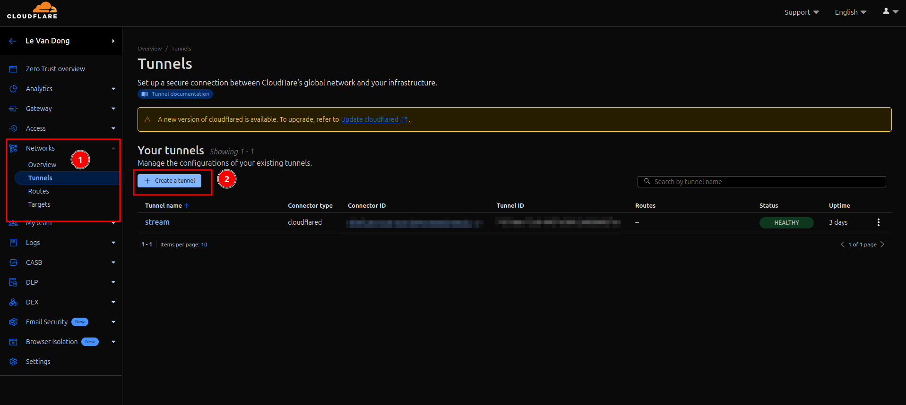
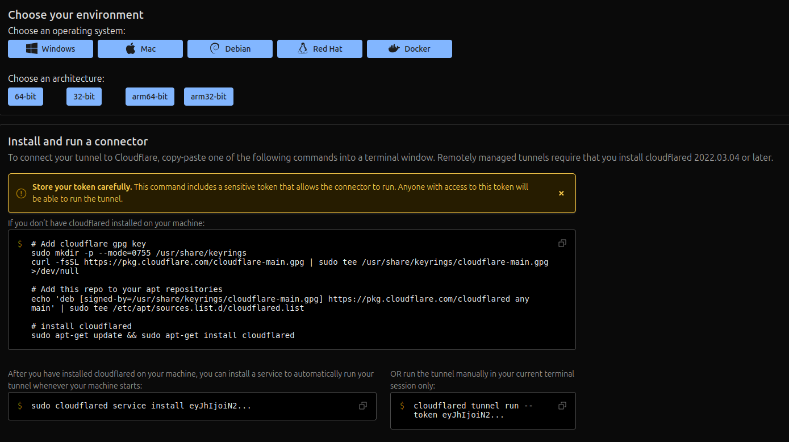
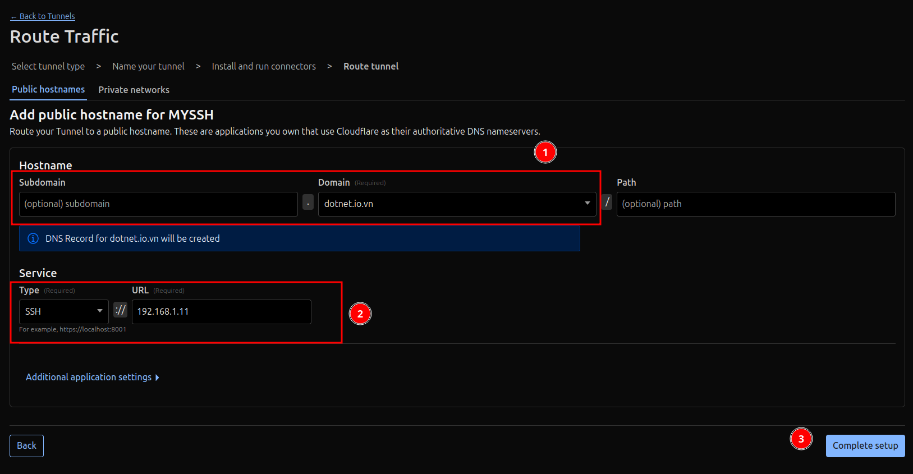

Nếu bạn có homelab ở nhà và mong muốn truy cập SSH nhưng không muốn mở port thì nên làm như thế nào cho đảm bảo an toàn nhất? Có rất nhiều cách để bạn có thể đạt được điều này, nhưng tôi sẽ chọn Cloudflare Tunnel vì đây là công ty rất lớn và Cloudflare thì cho tốc độ kết nối nhanh để tôi có thể truy cập SSH về máy ở nhà một cách mượt mà nhất.

---

## Chuẩn bị

- Tài khoản Cloudflare.
- Một domain, bạn có thể mua tên miền .io.vn cho rẻ tầm 30k/năm. Sau đó trỏ về Cloudflare.
- Một chiếc homelab.

## Cài đặt cloudflared cho homelab

Bạn hãy đăng nhập vào [Cloudflare One](https://one.dash.cloudflare.com) ở mục `Networks` chọn `Tunnel`, sau đó chọn `Create a tunnel`.



Khi hiện hai màn hình chọn type Tunnel, bạn chọn `Cloudflared`. Tiếp theo đặt tên cho nó ví dụ như "My SSH". Tiếp đến bấm `Save the tunnel`.

Kế đến, chọn tải về file `cloudflared` tương ứng với kiến trúc và hệ điều hành của bạn. Ở đây tôi dùng Ubuntu và 64-bit. Sau đó thực hiện cài đặt cloudflared. Và cuối cùng là thực hiện cấp quyền với token của cloudflared `sudo cloudflared service install eyJhIjo...`



Sau khi cài xong thì xuống cuối trang bấm nút `Next`.

Cuối cùng, chọn gán domain, setup service là `SSH` và địa chi IP LAN của bạn, ví dụ của mình là `192.168.1.11`



Vậy là setup xong cho homelab.

## Cài đặt cho máy tính kết nối với homelab

Với máy tính kết nối, bạn cũng phải cài `cloudflared` như đã hướng dẫn ở bên trên.

Tiếp theo mở SSH Config

```bash
vim ~/.ssh/config
```

Tiếp theo nhập nội dung như sau, thay đổi `your-domain.com` và `your-username` thành của bạn.

```
Host your-domain.com
  User your-username
  ProxyCommand /usr/local/bin/cloudflared access ssh --hostname your-domain.com
```

Cuối cùng thực hiện connect thôi

```bash
ssh your-domain.com
```

## Thêm lớp bảo mật

Nếu bạn muốn thêm một lớp bảo mật ví dụ như mỗi khi truy cập SSH Tunnel thì phải nhập email của bạn verified mới được đăng nhập thì bạn vào mục `Access` -> `Application` và tạo Self-host Application mới. Tiếp theo `đặt tên cho application` -> `Add public hostname` -> `Nhập hostname vừa rồi của bạn`

Tiếp theo, kéo xuống phần `Access policies` vào tạo Policies mới. Chú ý phần `Add rules` bạn sẽ chọn `Selector` là `Emails` với `Value` là email của bạn. Sau đó bấm `Save`.

Quay về trang Appication còn dang dở, chọn `Select exsiting policy` và chọn policy bạn vừa tạo. Và bấm tạo là thành công.

## Kết

Mong rằng bài viết này sẽ giúp bạn bảo mật truy cập SSH của mình và truy cập ở mọi nơi và đảm bảo chỉ có bạn mới được quyền truy cập.

## Tham khảo

- [Connect to SSH with client-side cloudflared (legacy)](https://developers.cloudflare.com/cloudflare-one/connections/connect-networks/use-cases/ssh/ssh-cloudflared-authentication/)
- [How to Set Up SSH via Cloudflare Tunnel | Secure Browser-Based SSH Access - Youtube](https://www.youtube.com/watch?v=lnw616HiINY)
